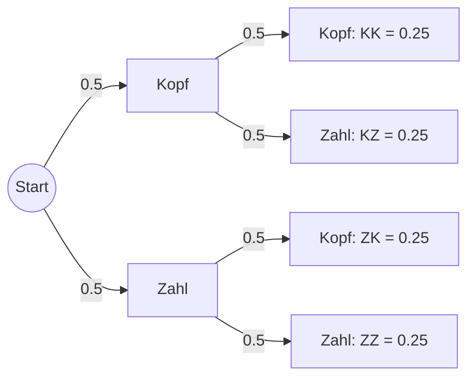

#Baum
#tree

```mermaid
graph LR
    S((Start)) -->|0.5| K1[Kopf]
    S -->|0.5| Z1[Zahl]
    K1 -->|0.5| KK[Kopf: KK = 0.25]
    K1 -->|0.5| KZ[Zahl: KZ = 0.25]
    Z1 -->|0.5| ZK[Kopf: ZK = 0.25]
    Z1 -->|0.5| ZZ[Zahl: ZZ = 0.25]
```
